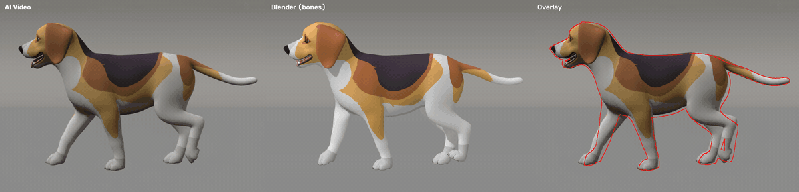
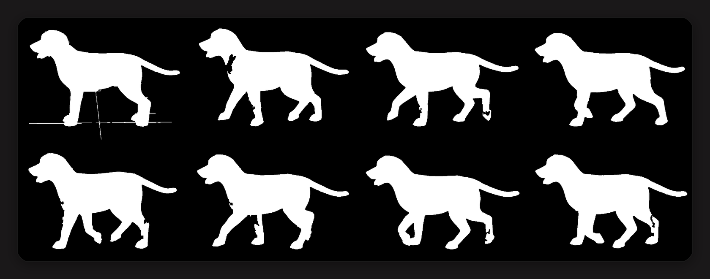
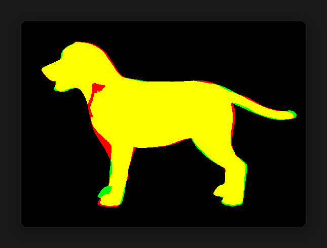
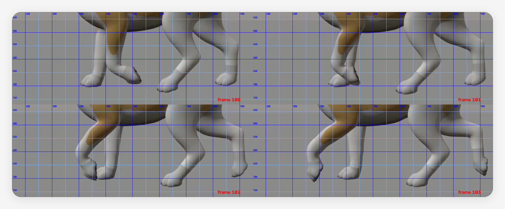
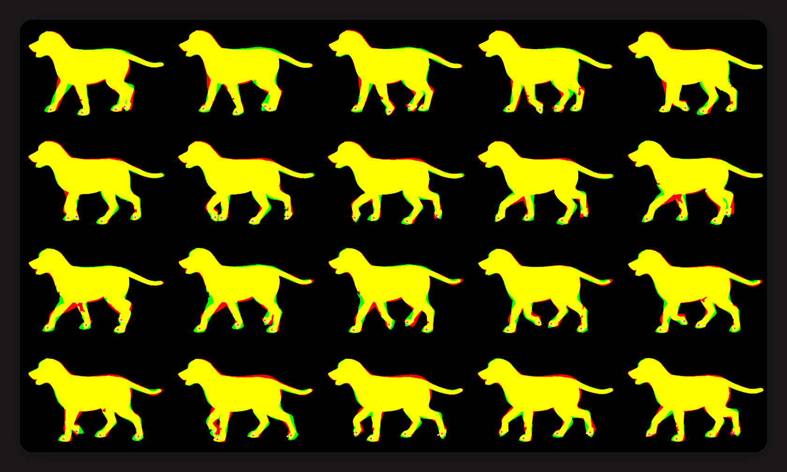
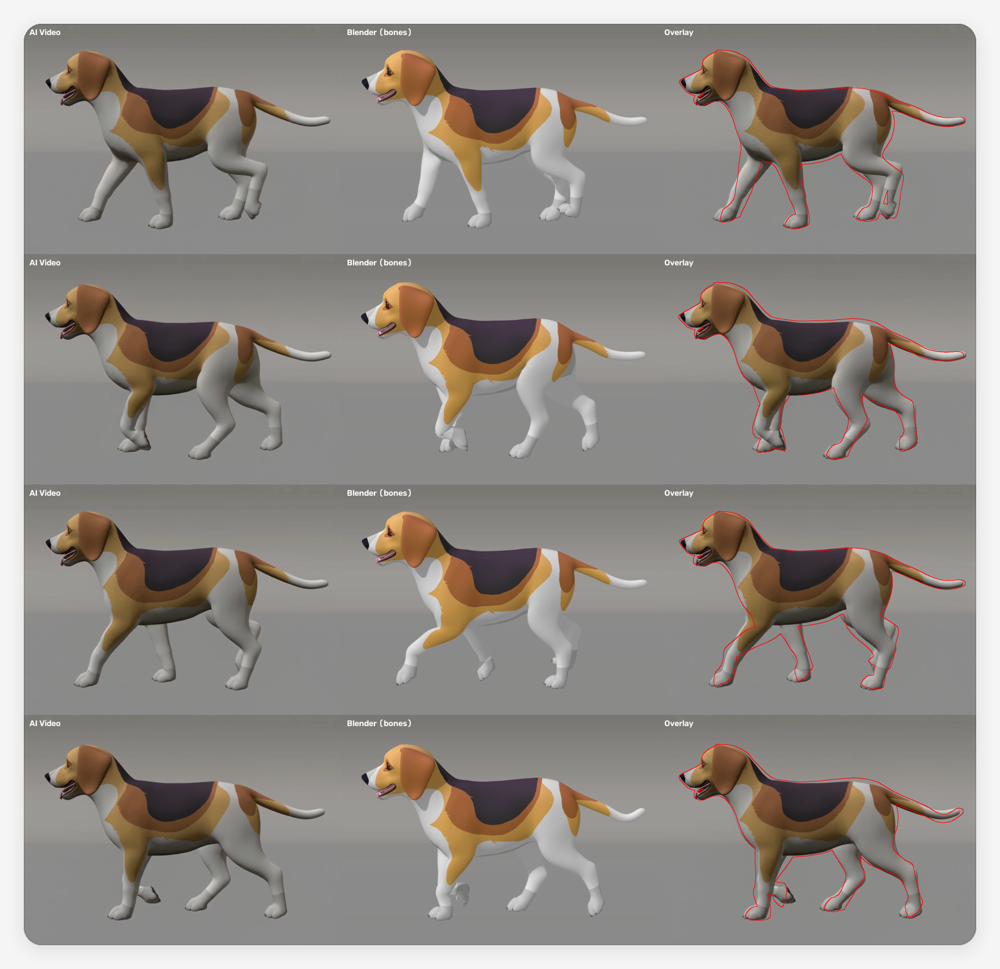
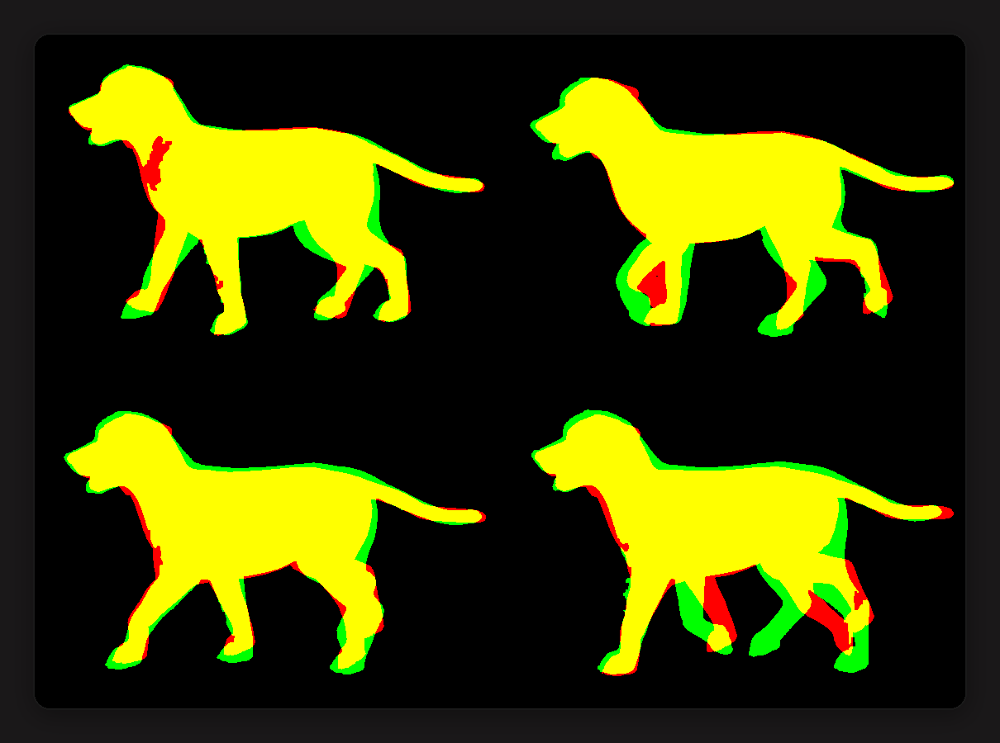

<picture>
  <source media="(prefers-color-scheme: dark)" srcset="assets/banner-dark.svg">
  
</picture>

<p align="center">
  
  
  
  
</p>

這是一套「拿 AI 生成的影片當動作來源，把 3D 動物的骨架一格一格對上去」的做法和程式。四足動物的走路動畫，請動畫師手調很花時間，叫 AI 直接寫關鍵影格又會一頓一頓的。看完這篇，你可以用自己的模型和一支 5 秒的 AI 影片，做出一段頭尾接得起來的循環走路動畫。

<p align="center">
  
  <br><sub>▲ 左：AI 影片｜中：Blender 骨架動畫｜右：Blender 的輪廓（紅線）疊在 AI 影片上。20 格一圈，無限循環。</sub>
</p>

> [!NOTE]
> 這個做法來自 YouTube 頻道 **Can It Code?** 的影片〈[Crazy AI Animation Workflow](https://www.youtube.com/watch?v=evK-Y83Qlco)〉。作者沒有公開他的對位程式，這個 repo 是我照影片講的原理，跟 Claude 一起重做出來的版本，不是作者的原始碼。

## 📦 這一包有什麼（分享給夥伴，給這一個連結就夠）

| 你想要 | 看這裡 | 一句話 |
|---|---|---|
| 看成果、看進度、下載模型 | [審片室（網頁）](https://terry12260201.github.io/heka-pet-review/) | 32 段動畫 3D 直接播、每支的 QA 狀態、生產線走到哪一站 |
| 人要做什麼、AI 要做什麼 | [docs/SOP.md](docs/SOP.md) | 七步分工表，人只做三件事 |
| 生影片用的 Prompt | [docs/PROMPTS.md](docs/PROMPTS.md) | 20 個動作，含喘氣／舌頭／耳朵的活力段、音效段、哪些要補正面或斜角、翻肚完整版 |
| 32 段動畫各在哪一步 | [docs/ACTIONS.md](docs/ACTIONS.md) | 每支的來源、狀態、該拍什麼角度、用哪個 Prompt |
| 自己跑一次 | 這篇往下的「八個步驟」 | 腳本在 `scripts/`，每支動畫一個設定檔在 `scripts/projects/` |
| 讓 Claude 幫你跑 | 跟 Claude 說「用 ai-video-to-bones 幫 Beagle 做一支〈動作〉」 | 需要裝 `ai-video-to-bones` skill（南瓜團隊內部） |

## 目錄

- [💡 先講結論](#-先講結論)
- [🧩 它是怎麼運作的](#-它是怎麼運作的)
- [🧰 開始前準備](#-開始前準備)
- [🚀 八個步驟](#-八個步驟)
- [🕳️ 我踩過的坑](#️-我踩過的坑)
- [⚠️ 這個做法的極限](#️-這個做法的極限)
- [❓ 常見問題](#-常見問題)
- [📖 名詞對照表](#-名詞對照表)

## 💡 先講結論

我用一隻 Beagle 模型和一支 5 秒的側面走路影片，實際跑了一輪，結果如下。

| 項目 | 數字 |
|---|---|
| 影片 | 121 格、24 fps、1130×820 |
| 找到的走路週期 | 20 格一圈（0.83 秒） |
| 循環首尾的剪影重疊率 | 99.2% |
| 模型與影片的剪影重疊率 | 平均 90.3%，最低 88.1% |
| 電腦運算時間 | 約 3 分 22 秒（M1 Mac） |
| 人工 | 標 20 格 × 4 個腳掌的位置 |

重疊率沒有到 100%，主要是 AI 影片裡的狗會微微變形，跟模型本來就不是同一個形狀。動起來順不順，請直接看上面那張 GIF 判斷。

## 🧩 它是怎麼運作的

想像你在**描圖**。你不用自己想狗怎麼走路，只要把影片墊在下面，照著一格一格描。

電腦做的事情也一樣：把模型擺一個姿勢，拍一張剪影，跟影片那一格的剪影比。哪裡沒對上，就把關節轉一點點，再比一次。

```mermaid
%%{init: {'theme':'base','themeVariables':{'fontFamily':'PingFang TC, Microsoft JhengHei, Noto Sans TC, sans-serif','primaryColor':'#FFFFFF','primaryTextColor':'#161415','primaryBorderColor':'#161415','lineColor':'#8A6400','secondaryColor':'#FDE68A','tertiaryColor':'#F5F5F5','clusterBkg':'#F5F5F5','clusterBorder':'#D9D9D9','edgeLabelBackground':'#F5F5F5'}}}%%
flowchart LR
  A["模型側面圖"] --> B["AI 生成<br>側面走路影片"]
  B --> C["逐格抓剪影"]
  C --> D["找出走一圈<br>要幾格"]
  D --> E["標腳掌位置"]
  E --> F["骨架逐格<br>貼合剪影"]
  F --> G["循環平滑"]
  G --> H["寫回 Blender<br>匯出動畫"]
  classDef gold fill:#FDC302,stroke:#161415,color:#2D2B2C,font-weight:bold
  class F gold
```



關鍵在「貼合」那一步。只比剪影不夠，因為四條腿在剪影裡會疊在一起，電腦分不出哪條是哪條。所以要先告訴它每一格四個腳掌大概在哪，再加幾條常識：

- **關節有活動範圍**：膝蓋不能反折。
- **踩在地上的腳掌要放平**：不然腳尖會亂翹。
- **左右腳差半圈**：走路時，右前腳現在的姿勢，就是左前腳半圈之前的姿勢。
- **前後格要連續**：這一格不能跟上一格、下一格差太多。

## 🧰 開始前準備

| 你需要 | 說明 | 標籤 |
|---|---|---|
| 綁好骨架的 3D 模型（`.glb`） | 四足動物，權重要先刷好 | 🟡 自備 |
| 一支 AI 生成的側面影片（`.mp4`） | 用你自己模型的側面圖去生，做法見步驟零 | 🟡 自備（生成要額度） |
| [Blender](https://www.blender.org/) 一定要 5或以上的版本  | 我用 5.1.2；不用開視窗，程式會自動在背景跑 | 🟢 免費 |
| Python 3.10 以上＋三個套件 | `pip install numpy scipy opencv-python` | 🟢 免費 |
| [ffmpeg](https://ffmpeg.org/) | 拆影片、做對照影片用 | 🟢 免費 |

這個 repo **沒有附狗的模型和影片**（模型有授權問題）。請把你自己的檔案放成：

```
input/model.glb
input/video.mp4
```

## 🚀 八個步驟

> [!TIP]
> 只想知道「人要做什麼、AI 要做什麼」看 [docs/SOP.md](docs/SOP.md)；要直接貼的影片 Prompt（含聲音、喘氣、耳朵舌頭的細節，以及哪些動作要補正面／斜角）看 [docs/PROMPTS.md](docs/PROMPTS.md)。下面是每一步的技術細節。

**多支動畫怎麼管**：每支動畫一個設定檔 `scripts/projects/<名稱>.py`（影片路徑、動畫名、循環或一次性、腳掌標記），跑的時候加 `AV2B_PROJECT=<名稱>`，中間檔和成品會分別放在 `work/<名稱>/`、`output/<名稱>/`。repo 裡已有 `walk`、`trot`、`run`、`eat`、`drink` 五支的設定可以照抄。

所有指令都在 repo 根目錄下執行。要改的設定全部集中在 [`scripts/config.py`](scripts/config.py)。

### 步驟零：先生出一支好對的影片

影片拍得好，後面省一半力氣。先算一張正側面、素色灰底的參考圖：

```bash
/Applications/Blender.app/Contents/MacOS/Blender -b --python scripts/00_render_side.py
```

把 `output/side_ref.png` 當首幀丟給影片生成 AI（我用 Seedance 2.5，720p、5 秒）。提示詞照影片作者的四條約束寫，完整可貼的版本在 [docs/SOP.md](docs/SOP.md#️-prompt)：

1. 只要側面
2. 鏡頭跟著動物走（動物留在畫面中間）
3. 不剪接、不變焦
4. 剛好四隻腳

**做對的話**，你會拿到一支動物在畫面中間原地走路、背景是乾淨素色的影片。

### 步驟一：把模型資料匯出來

讓 Blender 把頂點、權重、骨架倒成一個檔，之後對位就不用反覆開 Blender。先在 `config.py` 填好骨架和網格的物件名稱。

```bash
/Applications/Blender.app/Contents/MacOS/Blender -b --python scripts/01_export_rig.py
```

**做對的話**，你會看到 `OK rig.npz：7156 頂點、12510 三角面、57 根骨頭` 這類訊息（數字依你的模型而定）。

### 步驟二：抓出每一格的剪影

```bash
python3 scripts/02_segment.py
```

<p align="center"></p>

**做對的話**，打開 `work/check_masks.png`，每一格都是完整的白色剪影：腿沒有斷、沒有多出來的線。

> [!TIP]
> 腿斷掉或缺一塊，把 `config.py` 的 `BG_THRESHOLD` 調小；背景有雜點被當成狗，就調大。

### 步驟三：找出走一圈要幾格

```bash
python3 scripts/03_find_cycle.py
```

程式會拿每一格跟 N 格之後比，重疊率最高的 N 就是週期。

```text
建議 CYCLE_LEN = 20
建議 CYCLE_START（首尾重疊率, 起始格）： [(0.992, 96), (0.989, 94), ...]
```

**做對的話**，首尾重疊率會在 0.97 以上。把建議值填進 `config.py` 的 `CYCLE_LEN` 和 `CYCLE_START`。

### 步驟四：校正攝影機

找出影片是從哪個角度、多遠拍的。先把 `CALIB_FRAME` 設成「動物站著不動」的那一格。

```bash
python3 scripts/04_calibrate.py
```

<p align="center"></p>

**做對的話**，重疊率在 0.9 以上，疊圖幾乎全黃（黃＝重疊、綠＝只有影片、紅＝只有模型）。

### 步驟五：標腳掌

```bash
python3 scripts/05_annotate_sheets.py
```

程式會產生帶座標格線的腿部特寫圖。看圖讀出每一格四個腳掌中心的座標，填進 `config.py` 的 `KP`。

<p align="center"></p>

順序固定是「近前腳、遠前腳、近後腳、遠後腳」。誤差 10 到 15 像素沒關係，後面剪影會幫你修。我這次是把這幾張圖直接丟給 Claude 讀座標，20 格一次標完。

<details>
<summary><b>怎麼分辨近側腳和遠側腳？</b></summary>

- **看花紋**：我的狗只有靠鏡頭那側的肩膀有棕色斑塊，有斑塊的那條就是近前腳。
- **看高低**：鏡頭有一點透視，近側的腳掌踩地時，在畫面上會比遠側的低 20 到 25 像素。
- **看連續性**：踩在地上的腳，每一格只會往後移一點；突然往前跳很遠的，是正在跨步的那條。
- **看不到的**：被擋住或跑出畫面的腳掌，用前後格猜一個位置，第三個數字填 `0.3`（代表「我不太確定」）。

</details>

### 步驟六：貼合

```bash
python3 scripts/06_fit_cycle.py
```

<p align="center"></p>

**做對的話**，平均重疊率在 0.88 以上，`work/check_fit.png` 裡白點（你標的）和紫點（模型的腳掌）大致疊在一起。

### 步驟七：寫回 Blender，做對照影片

前六步確認都沒問題後，之後直接跑這一行就會從頭做到尾：

```bash
./scripts/run_all.sh
```

**做對的話**，`output/` 會有三樣東西：

| 檔案 | 用途 |
|---|---|
| `walk_loop.blend` | Blender 專案，動畫叫 `Walk_AIVideo_Loop`，保留模型原本所有動畫 |
| `walk_loop.glb` | 只含這支新動畫，21 格（最後一格＝第一格），可直接丟遊戲引擎 |
| `compare.mp4` | 三格並排的對照影片，循環播 5 次 |

<p align="center"></p>

### 一次性動作（吃、喝、坐下）怎麼跑

把設定檔的 `MODE` 改成 `"oneshot"`，給 `START`、`END`（影片第幾格到第幾格）和 `STEP`（每幾格對一次，10 秒影片用 2）。這個模式：

- 不找循環、不接頭尾、不用「左右腳差半圈」。
- 腳掌預設**留在站姿的位置**（吃、喝、聞地面都成立），所以通常不用標腳掌；要是動作會移動腳（坐下的後腳），再補 `KP`。
- 多了耳朵（`Ear_01.L/R`）和嘴巴（`mouth`）兩種關節，低頭時耳朵垂下、嘴巴開合都對得到。
- 匯出時每 `STEP` 格打一個關鍵影格，中間由 Blender 內插。

### 離開側面平面的動作（抖毛、歪頭）：要第二支正面影片

側面剪影讀不到「頭左右側滾、耳朵往兩邊飛」。我試過照影片節奏用程式硬補，結果像亂甩（南瓜一眼就退回）。正確做法：

1. 設定檔加 `EXTRA_DOF`（`head:Y` 側滾、`head:Z` 轉頭、`Ear_01.L:Z` 耳朵外翻…）。
2. 同一個動作再生一支**正面**影片（`AV2B_VIEW=front` 算正面參考圖），另開一個專案 `xxx_front` 對位：正面剪影看得到側滾和耳朵。
3. `06c_combine_views.py 側面專案 正面專案 側面起 側面止 正面起 正面止`：側面給 X 軸關節（身體、四肢），正面給 Y／Z 軸關節和耳朵，兩支影片用「開始動／停止動的格」線性對齊。

兩支影片不是同一次生的，節奏一定有差；對齊只能到「同一段時間裡甩了差不多的次數」，不是逐格精準。

### 步驟八：人眼驗收，逐格修

打開 `compare.mp4` 看。哪一格不對，回去改那一格的腳掌標記，再跑一次步驟六和七。影片作者把這個叫「小實驗室」：只要說「第 47 格，腿往後跳了」，幾輪就修好。

## 🕳️ 我踩過的坑

這幾個坑各花了我一輪重做，照順序列出來。

**1. 只靠剪影追蹤，腿一交叉就跟丟。** 我第一版是從站姿開始、一格一格往下追。走到第 28 格，重疊率從 93% 掉到 76%，腿整個對錯。影片作者也遇到一樣的事，他的解法是讓 AI 逐格標腿，我照做才過。

<p align="center"></p>

**2. 白腿配灰背景，剪影會缺腿。** 腿的顏色跟背景只差一點點，門檻設太高，腿就不見了。後來發現 AI 影片的背景非常乾淨（誤差只有 1 到 2 個色階），門檻可以壓到 6。

**3. 不設關節範圍，腳掌會翻過去。** 剪影看不出腳掌朝哪邊，程式會為了多貼合一點點，把腳趾轉 180 度。加上關節範圍和「落地腳掌放平」之後才正常。

**4. 臉死死的。** 對位只動身體和四肢，臉、耳朵、舌頭完全沒動，狗看起來像標本。解法不是再對一次，是把素材包 `Idle_1` 那支很活的待機動畫裡「臉那十六根骨頭」的曲線疊到每一支新動畫上（`scripts/09_merge_export.py` 的生命感層），循環動作還會把窗尾混回窗頭讓它接得起來。喘氣、舌頭、耳朵一次到位。

**5. 一次性動作接不回待機。** 吃、喝這種不循環的動作，影片怎麼結束，動畫就怎麼結束。現在的做法：Prompt 一定寫「頭尾都是圖1 的站姿」，程式再把頭尾各 6 格釘回站姿，接點才看不出來。

**6. 影片裡的狗會慢慢變形。** 第 5 格校正好的攝影機，到第 96 格會偏掉幾個像素。所以貼合的時候要回頭微調攝影機。

**7. 逐格的結果會抖。** 腳趾一格最多跳 1.19 弧度（68 度）。最後用「只留低頻」的方式平滑，順便保證頭尾一定接得起來，代價是重疊率掉不到 1%。

<details>
<summary><b>技術細節：速度是怎麼從「每格 10 秒」壓到「整段 2.5 分鐘」的</b></summary>

- **不要每比一次就叫 Blender 算圖。** 我用 numpy 自己做蒙皮和投影，Blender 只在頭尾各出場一次。
- **蒙皮用稀疏矩陣。** 一開始用 `einsum` 對 7156 個頂點 × 57 根骨頭硬算，一次 24 毫秒；每個頂點其實只受 4 根骨頭影響，改成稀疏矩陣後不到 1 毫秒。
- **剪影不用真的畫三角形。** 把頂點、三角形中心、邊中點灑成點，再做一次形態學閉合把縫補起來。精確的畫法只留給最後驗收。
- **半解析度比對。** 565×410 就夠了。
- **誤差函數用距離圖。** 「模型的點離影片剪影多遠」加上「影片剪影的點離模型剪影多遠」，兩個方向都算，交給 `scipy.optimize.least_squares`。
- **循環平滑用傅立葉。** 對 20 格做 FFT，只留前 5 個頻率（腳趾留 3 個）再轉回來，曲線自然平滑且首尾相接。

</details>

## 📊 目前做過的動作

<p align="center">
  
  <br><sub>▲ 第二支：小跑，13 格一圈。做法跟走路完全一樣，只改了設定檔。</sub>
</p>


| 動作 | 類型 | 格數 | 剪影重疊率（平均／最低） | 備註 |
|---|---|---|---|---|
| 走路 `walk` | 循環 | 20 | 0.90／0.88 | 第一支，流程就是用它建起來的 |
| 小跑 `trot` | 循環 | 13 | 0.90／0.88 | 對角步態，左右對稱約束有效 |
| 奔跑 `run` | 循環 | 13 | 0.86／0.84 | 不對稱步態，關掉對稱約束；腿交疊多，腳掌標記最難讀 |
| 吃東西 `eat` | 一次性 | 120（每 2 格） | 見 `work/eat/` | 頭、頸、耳朵、嘴巴為主，腳不動 |
| 喝水 `drink` | 一次性 | 120（每 2 格） | 見 `work/drink/` | 同上 |

## ⚠️ 這個做法的極限

> [!WARNING]
> 單一支側面影片沒有深度資訊，所以只有「側面看得到的動作」做得出來。**人物動作不適用**，影片作者自己試過，手和物件會穿過身體。

- **只會動側面那個平面。** 身體左右搖擺、尾巴橫甩、轉頭看鏡頭，影片裡看不出來，動畫裡也不會有。這些要另外疊一層程序化動畫。
- **耳朵沒做。** 這次沒有把耳朵骨頭放進調整清單。
- **腳掌角度不是每格都準。** 例如遠側後腳有幾格是腳尖朝下，影片裡是平踩。
- **腳掌要人標（或請 AI 看圖標）。** 20 格 × 4 個點，目前省不掉。
- **會轉向鏡頭、會翻身的動作不行。** 解法是多角度影片，作者下一集在試，我還沒做。

## ❓ 常見問題

<details>
<summary><b>換一隻動物要改哪裡？</b></summary>

只改 `scripts/config.py`：物件名稱、要調整的骨頭清單（`DOF`）、每條腿的骨頭鏈（`leg_chain`）、關節範圍（`LIMITS`）、腳掌標記（`KP`）。骨頭名稱照你的骨架填。

</details>

<details>
<summary><b>校正攝影機的重疊率一直上不去？</b></summary>

通常是 `CALIB_FRAME` 選到的那一格，動物的姿勢跟模型原始姿勢差太多。挑一格最像「站著不動」的。如果影片第一格是你丟進去的原圖（背景不一樣），跳過它。

</details>

<details>
<summary><b>模型的面朝向不一樣怎麼辦？</b></summary>

程式假設動物頭朝 −Y、左右是 X 軸、上是 Z 軸，鏡頭在 +X 那一側（Blender 匯入 glTF 的常見朝向）。朝向不同的話，要改 `fitlib.py` 裡的 `rotx`（旋轉軸）和 `project`（鏡頭位置）。

</details>

<details>
<summary><b>匯出的 .glb 在引擎裡循環會頓一下？</b></summary>

`.glb` 含 21 格，最後一格跟第一格是同一個姿勢。引擎設成循環時，播放範圍取 0 到 0.833 秒（20 格），或把最後一格當成跟第一格重疊的接點。

</details>

## 📖 名詞對照表

| 名詞 | 白話 | 在這篇的角色 |
|---|---|---|
| 骨架（rig） | 藏在模型裡的一組關節，像布偶裡的鐵絲 | 我們要調的就是每根骨頭的角度 |
| 權重（weights） | 每塊外皮聽哪根骨頭的話、聽幾成 | 決定骨頭動的時候外皮怎麼跟 |
| 蒙皮（skinning） | 骨頭帶著外皮一起動的計算 | 程式自己算，不用開 Blender |
| 剪影（silhouette） | 只看外框的影子形狀 | 模型和影片比對的依據 |
| 重疊率（IoU） | 兩個剪影重疊的面積 ÷ 合起來的面積 | 判斷對得準不準，1.0 是完全重疊 |
| 關鍵影格（keyframe） | 動畫裡「這一刻擺這個姿勢」的標記 | 最後每一格、每根骨頭都有一個 |
| 循環（loop） | 最後一格接回第一格，可以無限播 | 遊戲裡的走路動畫都要這樣 |
| 近側／遠側腳 | 靠鏡頭那邊的腳和另一邊的腳 | 剪影分不出來，所以要人標 |
| 最佳化 | 一直微調、看誤差有沒有變小，直到調不動 | 貼合那一步的做法 |

## 下一步

- 把你的模型和影片放進 `input/`，從步驟一開始跑。
- 我接下來想試的：多角度影片補深度、把腳掌標記自動化、在遊戲引擎裡疊上呼吸和尾巴的程序化動畫。
- 有問題或跑出好玩的結果，歡迎開 [Issue](https://github.com/terry12260201/ai-video-to-bones/issues) 給我。

程式碼以 [MIT 授權](LICENSE) 釋出。

<sub>— 南瓜｜南瓜虛擬科技 · XR／3D／AI 工作流 · 最後更新 2026-10-04</sub>
