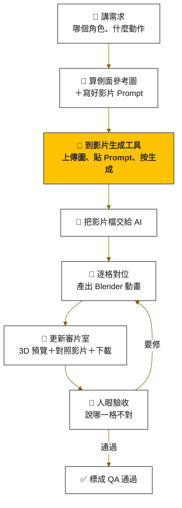

# 📋 SOP｜從「我要一支動畫」到「審片室看得到」

這份是給**提需求的人**和**執行的 AI（Claude）**看的分工表。提需求的人只要做三件事：講需求、按一次生成、看結果。其他都交給 AI。

## 一張圖看完



## 誰做什麼

| 步驟 | 誰 | 做什麼 | 產出 | 花多久 |
|---|---|---|---|---|
| 1 | 👤 你 | 跟 AI 說：「幫 **〈角色〉** 做一支 **〈動作〉** 動畫」 | 一句話 | 10 秒 |
| 2 | 🤖 AI | 檢查這個動作適不適合（見下方「先判斷」），算側面參考圖，寫好 Prompt、建議秒數 | `side_ref.png`＋一段可直接貼的 Prompt | 1 分鐘 |
| 3 | 👤 你 | 到影片生成工具：上傳參考圖、貼 Prompt、設秒數與畫質、按生成、下載 mp4 | 一支 mp4 | 3–5 分鐘 |
| 4 | 👤 你 | 把 mp4 丟給 AI（給路徑或拖進對話） | — | 10 秒 |
| 5 | 🤖 AI | 拆格→抓剪影→找循環→校正攝影機→看圖標腳掌→貼合→平滑→寫回 Blender | `.blend`、`.glb`、對照影片 | 約 10 分鐘 |
| 6 | 🤖 AI | 把新動畫放進審片室：3D 預覽、對照影片、狀態設成「待 QA」 | 審片室網址 | 2 分鐘 |
| 7 | 👤 你 | 打開審片室看。不對就說「第 N 格，〈哪條腿〉〈怎麼了〉」 | 修改意見或通過 | 看你 |

## 🤖 先判斷：這個動作適不適合

單一支側面影片沒有深度，AI 接到需求要先分類，不適合的要**先講**，不要硬做。

| 類型 | 例子 | 判斷 |
|---|---|---|
| 四隻腳都在側面那個平面上動 | 走路、小跑、奔跑、原地踏步、坐下、趴下、伸懶腰、低頭嗅聞、吃東西 | 🟢 適合 |
| 身體會轉向或離開側面平面 | 轉圈、回頭看鏡頭、翻肚、側躺翻身、左右歪頭 | 🔴 不適合（要多角度影片，還沒做） |
| 只動局部 | 搖尾巴、抖耳朵、眨眼 | 🟡 不需要這套，直接做疊加層比較快 |

## 🎬 影片設定

| 設定 | 值 | 為什麼 |
|---|---|---|
| 模式 | 圖生影片，首幀＝側面參考圖 | AI 拍的才會是「你那隻」 |
| 比例 | 16:9 | 四足動物是橫的，左右要留跨步空間 |
| 畫質 | 720p 等級（我們工具裡叫「成品」） | 再低腿的邊緣會糊，剪影抓不乾淨 |
| 秒數（循環動作） | 5 秒 | 起步約 1.5 秒＋至少 3 圈才挑得到好的循環 |
| 秒數（一次性動作） | 動作本身長度＋2 秒 | 頭尾各留 1 秒站姿，才接得回待機 |
| 音訊 | 關 | 用不到，省一點 |

## ✍️ Prompt

完整範本（固定段＋活力段＋動作段＋聲音段，20 個動作，含哪些要補正面／斜角）在 [PROMPTS.md](PROMPTS.md)。下面是最精簡的版本。

**我們的影片生成工具實測（2026-10-06）**：
- 「圖生影片」直接送出會回 HTTP 400（`omni_reference_task_type` 參數錯誤）。
- ❌ 「文生影片＋參考圖」送得出去，**但風格會跑掉**（狗變平面 2D 卡通），剪影比例不對，不能用。
- ✅ **能用的路線：打開任何一支舊的「圖生影片」工作 → 「微調再生成」→ 重新上傳第一格圖、換 Prompt、勾生成音訊、選成品、歸戶 → 生成**。這條會沿用「第一格」模式，模型長相不變。
- Prompt 第一行一定放標題 `[Beagle · 代號 中文 · 角度 · 秒數]`，列表才認得出來。歸戶標籤每送一次會清掉，下一支要重選。

**固定段（每支都放）**

```text
Animate the exact stylized cartoon {SPECIES} game model in the supplied image.
Preserve its exact body proportions, colors, markings and exactly four legs — do not add, remove or merge limbs.
Strict side-view profile, facing left, the whole body always fully in frame.
Locked-off tracking camera that follows the animal so it stays centered at a constant size.
No cuts, no zoom, no camera rotation, no motion blur.
Keep the plain flat grey studio background and even lighting. No ground shadow, no props, no text.
```

**動作段（挑一段接在後面）**

| 動作 | 狀態 | 動作段 |
|---|---|---|
| 走路 | ✅ 實測過 | `The {SPECIES} walks forward in place at a calm, steady pace with a natural four-beat walking gait. Even rhythm, each paw clearly lifts and lands, the tail sways gently. The motion loops seamlessly.` |
| 小跑 | ⬜ 還沒測 | `The {SPECIES} trots forward in place at a brisk, steady pace with a natural two-beat diagonal gait. Light bounce in the body, even rhythm. The motion loops seamlessly.` |
| 奔跑 | ⬜ 還沒測 | `The {SPECIES} runs forward in place at full speed with a natural gallop: the spine flexes and extends, front and hind legs gather and stretch. Even rhythm. The motion loops seamlessly.` |
| 坐下 | ⬜ 還沒測 | `The {SPECIES} stands still for one second, then smoothly sits down, lowering its hindquarters to the ground while the front legs stay straight. It holds the sit for one second.` |
| 趴下 | ⬜ 還沒測 | `The {SPECIES} stands still for one second, then smoothly lies down on its belly, front legs stretched forward. It holds the pose for one second.` |
| 伸懶腰 | ⬜ 還沒測 | `The {SPECIES} stands still for one second, then stretches: front legs slide forward and the chest lowers while the hips stay high, holds, then returns to standing.` |
| 低頭嗅聞 | ⬜ 還沒測 | `The {SPECIES} stands still, lowers its head to the ground and sniffs with small nose movements, legs stay planted, then raises its head back up.` |
| 吃東西 | ⬜ 還沒測 | `The {SPECIES} stands still, lowers its head and eats from the ground with small rhythmic head bobs, legs stay planted, then raises its head back up.` |

把 `{SPECIES}` 換成動物（`beagle dog`、`cat`…）。可以再加一句外型描述幫 AI 守住比例，例如 `Preserve its compact, sturdy body and short legs.`

> [!IMPORTANT]
> 「一次性動作」（坐下、趴下…）目前的程式只處理循環動作。做一次性動作時，跳過「找循環」那步，改成直接指定起訖格，並拿掉「左右腳差半圈」那條約束。這部分還沒實作，是下一步。

## ✅ 驗收清單

AI 自己先檢查前四項，後兩項一定要人看。

- [ ] 平均剪影重疊率 ≥ 0.88，最低一格 ≥ 0.85
- [ ] 循環首尾重疊率 ≥ 0.97
- [ ] `.glb` 裡的動畫名稱正確、格數＝循環格數＋1、最後一格＝第一格
- [ ] 模型原本的其他動畫都還在、長度沒變
- [ ] 👤 看對照影片：四條腿的前後順序跟 AI 影片一致
- [ ] 👤 看 3D 預覽轉一圈：沒有穿模、腳掌沒有翻過去、循環接點看不出來

## 🔧 修改的說法

看完不滿意，用這個句型講，AI 就知道改哪：

> 第 **〈幾〉** 格，**〈近前／遠前／近後／遠後〉** 腳 **〈太前面／太後面／腳尖翹起來／穿進身體〉**。

AI 會回去改那一格的腳掌標記，重跑貼合和匯出，再更新審片室。同一支修三輪還不行，就換一支影片重生，不要硬凹。
